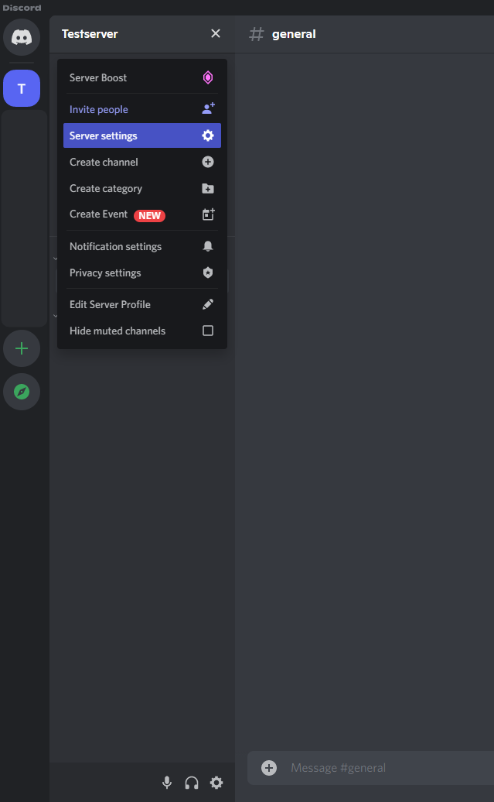
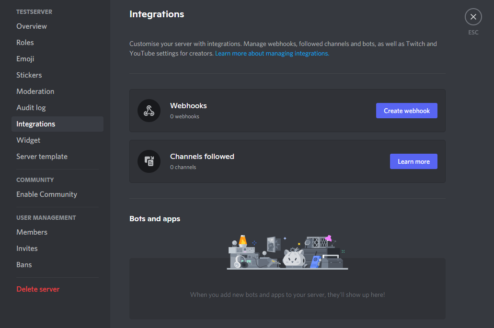
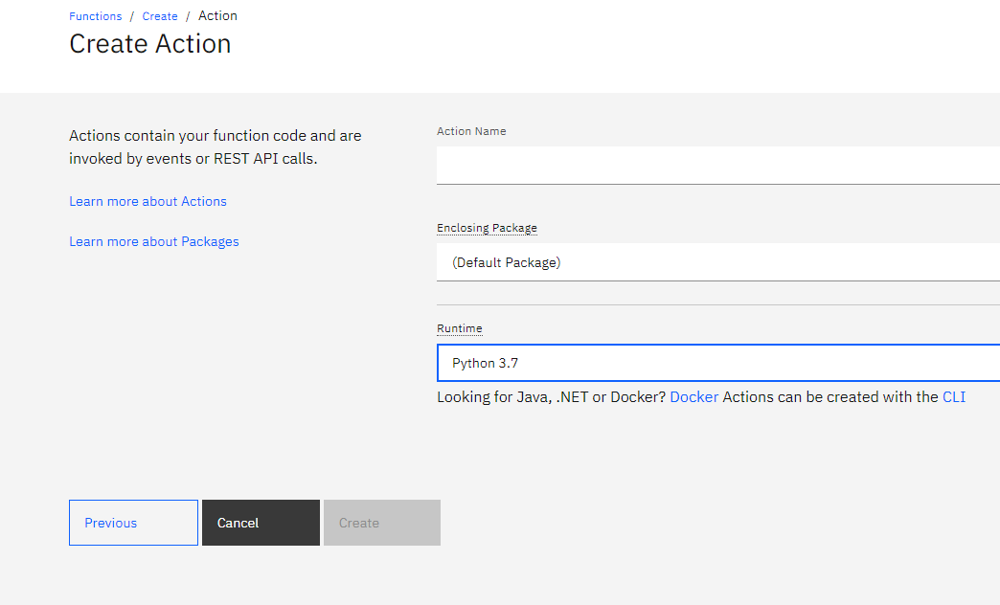
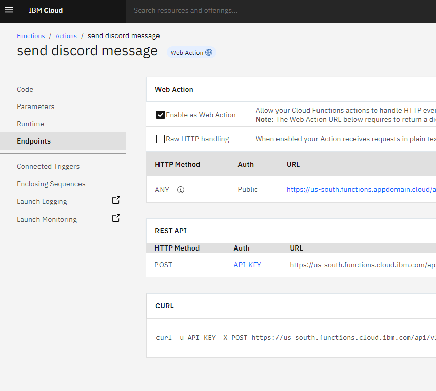

# Make Watson Assistant send messages to your Discord Server

## Prerequisites

1. Sign up for an [IBM Cloud account](https://cloud.ibm.com/registration).
2. Fill in the required information and press the „Create Account“ button.
3. After you submit your registration, you will receive an e-mail from the IBM Cloud team with details about your account. In this e-mail, you will need to click the link provided to confirm your registration.
4. Now you should be able to login to your new IBM Cloud account ;-)
5. Create a [Discord](https://discord.com/?utm_source=google&utm_medium=advertising&utm_campaign=01/28/2020-google-de-registrations-brand_exact&utm_content=--t%3Apa--ag%3Aes&gclid=Cj0KCQiA15yNBhDTARIsAGnwe0WTA2Qz1iVVEsYdfvrBsUWP_5athAzzfClplhD-82YHGrY53EKwQwsaAp_6EALw_wcB&gclsrc=aw.ds) account, as well your own Discord server (both are free of charge).


## Activate Webhooks in Discord

We want to enable webhooks in our Discord server's settings, which will be used by `Watson Assistant` to send messages.

1. Go to your server's settings
    
2. Navigate to Integrations
   
3. Create a new Webhook, and copy its URL

Note: Discord does not require any additional Authentification, which means that anyone who has the URL can use the Webhook. Ensure that only you, and people you trust have access to it.

## Set up your cloud function

### Create cloud function
We want to set up a cloud function, which Watson Assistant will be able to access. To do that, you need to go to your `IBM Cloud Dashboard`, and select `Functions`.

Alternatively you can click [here](https://cloud.ibm.com/functions) to access the IBM Cloud functions.

 Now you can create a new Action. Give it a sensible name, select `python` as your runtime, and click create.

 

Paste in the code that can be found [here](./send-discord-message.py), change the value of `discordurl` to your URL, and save your changes.

### Test cloud function

If you want to test it, you can click on `Invoke with parameter`, paste in the input below, click `apply`, and press `Invoke`.

```
{
    "content" : "this is a test message sent by your cloud function"
}
```

If the message was sent successfully, the result should look like this.


### Enable as Web Action

Now we need to create an endpoint, which will be used by `Watson Assistant` to invoce your function.

On the left side, click `Endpoints` and check the box called `Enable as Web Action`. Press save, and copy the URL.



## Set up your Assistant

### Set up Watson Assistant
Go back to your Dashboard, and type `Watson Assistant` into the search bar. If you already have a `Watson Assistant` service you can use it, otherwise you can create a free lite version either by clicking `Watsion Assistant` under the `Catalog Results` Section or following this [link](https://cloud.ibm.com/catalog/services/watson-assistant).


### Create your own Skill

Afterwards launch your `Watson Assistant` Service, and look for `Skills` on the left.

> If you can't find it, click on the profile icon in the upper right corner, and click `Switch to classic experience`.

Create a new skill, select `Dialog skill` and click next. Select `Upload skill` and provide the `send-discord-message.py` file.

### Enable Webhooks

Before you can test your assistant, you need to provide the cloud funtion's URL.

Click on Options->Webhooks, paste in the URL, and ADD A `.json` AT THE END.

>We could use Discord's webhook link direcly, without adding a .json, and it would send the message as well. However, Discord doesn't return anything (that Watson Assistant can understand), which would prevent us from informing the user of our assistant, that the message was sent correctly.

## Test your assistant 

Now you can click on the `Try it` button and test weather the assistant is working correctly.

---
